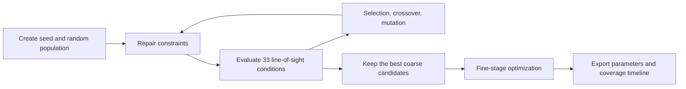

# Two-Stage Genetic Algorithm for Multi-UAV Coverage

> **High-dimensional optimization · Genetic algorithms · Computational geometry · MATLAB**

A research-grade MATLAB implementation of a constrained, two-stage genetic algorithm for coordinating five UAVs and fifteen time-triggered occlusion clouds. The project transforms a complex geometric scheduling problem into a reproducible 40-dimensional optimization pipeline.

The model searches over 40 coupled decision variables and evaluates whether three moving objects' lines of sight to eleven target points are simultaneously blocked. It demonstrates strong command of evolutionary optimization, constraint handling, geometric intersection testing, objective design, and numerical experiment management.

Project timeline: the original modeling work was completed in September 2025. The code was cleaned, documented, and packaged as a portfolio repository in October 2026.

## Highlights

- 40-dimensional chromosome: heading, speed, three release times, and three fuse times for each UAV.
- Two-stage search: a coarse exploratory stage followed by fine local refinement.
- Hard objective: total time during which all 33 lines of sight are blocked.
- Soft objective: partial-coverage integral used to guide the search when the hard objective is sparse.
- Constraint repair for speed, release spacing, fuse time, and the 67-second evaluation horizon.
- Deterministic runs through an explicit random seed.

## Technical capabilities demonstrated

- Encoded a mixed geometric and temporal decision problem as a 40-dimensional chromosome.
- Designed a coarse-to-fine search strategy to balance global exploration and local refinement.
- Implemented line-segment/sphere intersection tests across 33 simultaneous visibility constraints.
- Built feasibility repair for speed bounds, release spacing, fuse timing, and horizon limits.
- Combined a strict discontinuous objective with a smooth auxiliary objective to improve search guidance.
- Added deterministic seeding, validation logic, spreadsheet export, and coverage-timeline visualization.

## Model overview

Each UAV contributes eight genes:

```text
[heading, speed, release_1, fuse_1, release_2, fuse_2, release_3, fuse_3]
```

Five UAVs therefore produce a 40-dimensional chromosome. A candidate solution is decoded into release and detonation points. At each time step, the code checks whether a line segment from a moving object to a sampled target point intersects at least one active spherical cloud.



## Optimization objective

The fitness combines a strict hard objective and a smoother auxiliary objective:

```text
fitness = global_33_line_coverage + lambda * partial_coverage_integral
```

The auxiliary term gives the genetic algorithm a useful search direction even when no individual initially satisfies all 33 line-of-sight conditions.

## Quick start

Requirements:

- MATLAB R2020a or later is recommended.
- No third-party toolbox is required by the current script.

Clone the repository, open MATLAB in the repository folder, and run:

```matlab
run_two_stage_ga(42)
```

The optional number is the random seed. Using the same seed makes debugging and comparisons easier. Generated files are written to `results/`:

```text
results/latest_run.xlsx
results/latest_run.png
```

The full optimization can take time because the second stage evaluates the geometry at a 0.01-second resolution.

## Repository structure

```text
.
├── run_two_stage_ga.m   # Model, genetic algorithm, validation, and export
├── results/
│   └── README.md        # Interpretation and current validation status
├── .gitignore
└── README.md
```

## Validation status

The implementation deliberately applies a demanding validation standard: release and detonation must remain inside the 67-second horizon, and all 33 lines of sight must be blocked simultaneously. Existing saved exploratory runs did not produce a positive hard-objective value under this strict definition.

An earlier exploratory figure reported 6.25 seconds for one moving object under a looser evaluation window. It is deliberately excluded from the headline result because it does not satisfy the final global criterion. This distinction is important: a visually attractive chart should not replace a correctly defined objective.

The result highlights the sparsity and difficulty of the feasible region. The repository should therefore be read as a rigorous optimization implementation and research baseline, not as proof that a globally optimal positive-coverage solution has been found.

## Known limitations

- The target surface is approximated by eleven representative points.
- Clouds are modeled as spheres with simplified vertical motion.
- The hard objective is discontinuous and extremely sparse.
- A genetic algorithm cannot certify global optimality.
- MATLAB execution was not available during repository packaging, so the renamed entry point and export path were reviewed statically but not rerun in that environment.

## 中文说明

本项目使用两阶段遗传算法协调 5 架无人机和 15 个定时遮蔽云团，共优化 40 个决策变量。第一阶段采用较粗时间步进行广泛搜索，第二阶段在优秀候选解附近精细搜索。代码包含约束修复、线段与球体相交判定、硬目标与软目标组合、结果导出和时间线绘图。

当前严格口径要求在 67 秒内同时遮挡 3 个运动对象到 11 个目标点的全部 33 条视线。已有探索结果尚未得到正的严格目标值，因此本仓库不夸大结论，而将其定位为一个可继续改进的算法实现与验证基线。

## Academic use

This repository contains code and a short problem summary only. It does not reproduce the original competition statement or claim ownership of the problem text. If this work was completed by a team, contributors and individual responsibilities should be added before the repository is used as a formal portfolio item.
